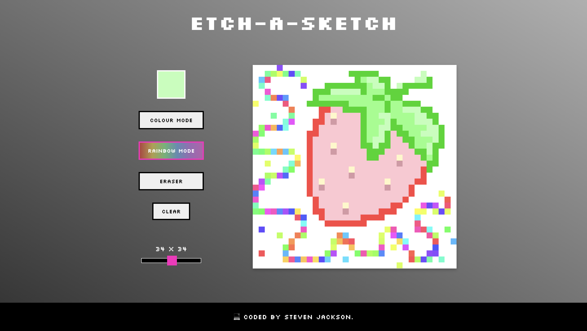

# Etch-a-Sketch



Etch-a-Sketch is a simple web-based drawing application inspired by the classic toy of the same name. With this Etch-a-Sketch app, you can create colourful drawings, switch between different drawing modes, and adjust the size of your drawing canvas.

## Features

- **Drawing Modes:** Choose between different drawing modes, including colour mode, rainbow mode, and eraser mode.
- **Colour Picker:** Select your preferred colour using the colour picker tool.
- **Rainbow Mode:** Automatically generates random colours for a vibrant drawing experience.
- **Eraser Mode:** Easily erase parts of your drawing with the eraser tool.
- **Adjustable Canvas Size:** Resize the drawing canvas to fit your needs using the size slider.

## Usage

1. Open the Etch-a-Sketch application in your web browser.
2. Use the colour picker to choose your drawing colour.
3. Select a drawing mode: colour mode, rainbow mode, or eraser mode.
4. Click and hover over the canvas to start drawing.
5. Click on the canvas to fill a square with colour (colour and rainbow mode only).
6. Use the size slider to adjust the canvas size.
7. Click the "Clear" button to erase the entire drawing canvas.

## Technologies Used

- HTML5
- CSS3
- JavaScript

## How To Use

### Option 1: Visit the live demo
To use Etch-a-Sketch, [visit the live demo](https://estibenjack.github.io/etch-a-sketch/) and start drawing!


### Option 2: Clone using Git
1. **Clone this repository:**
    ```sh
    $ git clone https://github.com/estibenjack/etch-a-sketch.git
    ```

2. **Go into the repository:**
    ```sh
    $ cd etch-a-sketch
    ```

3. **Open index.html:**
    - On Windows:
    ```sh
    $ .\index.html
    ```
    - On macOS/Linux:
    ```sh
    $ open index.html
    ```

## Credits

- **Steven Jackson** - Developer - [GitHub](https://github.com/estibenjack)
